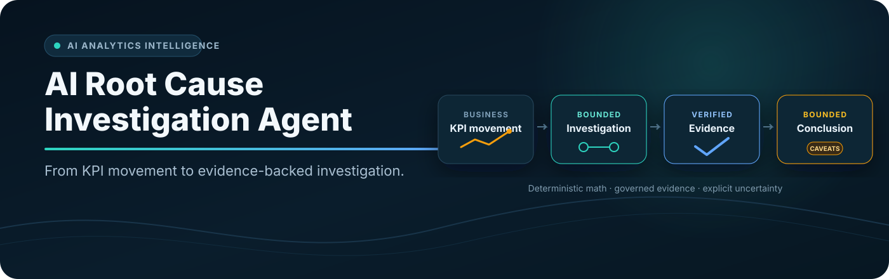
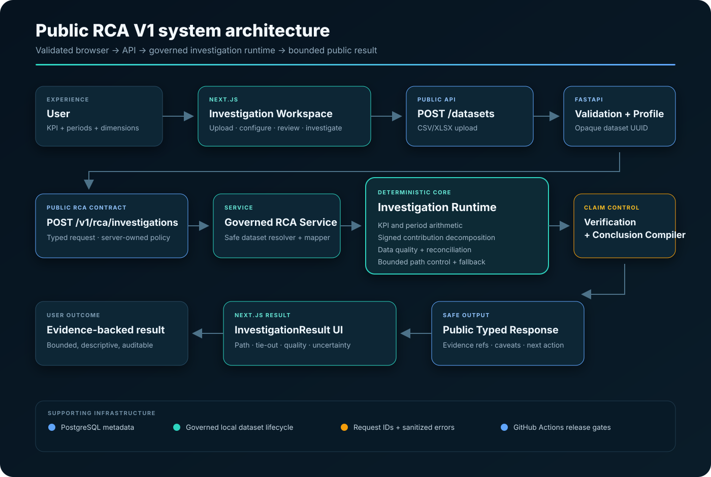
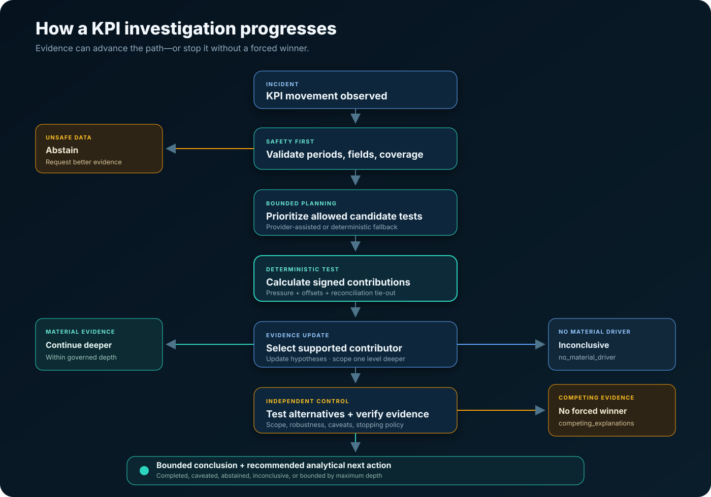
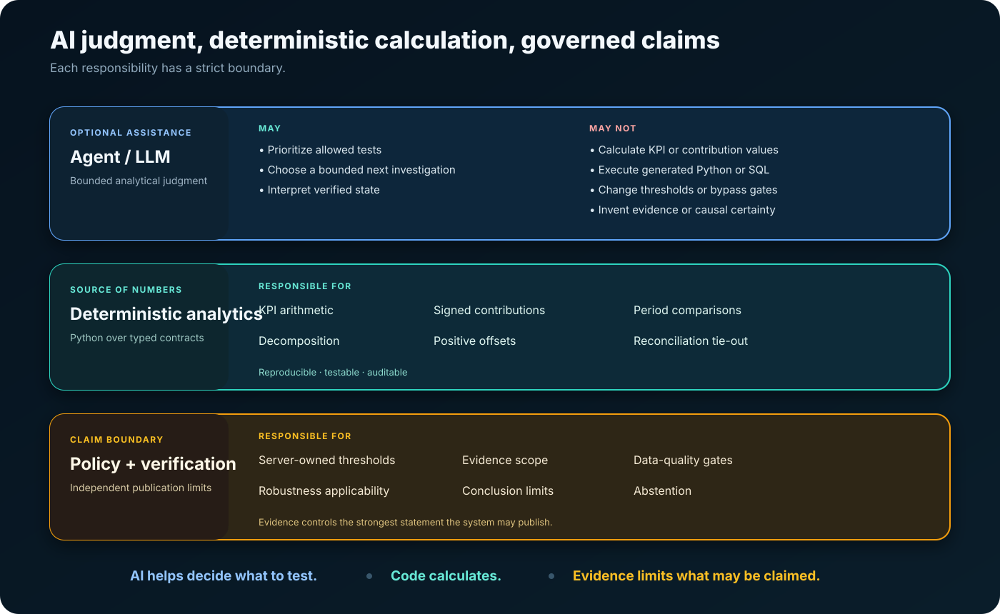
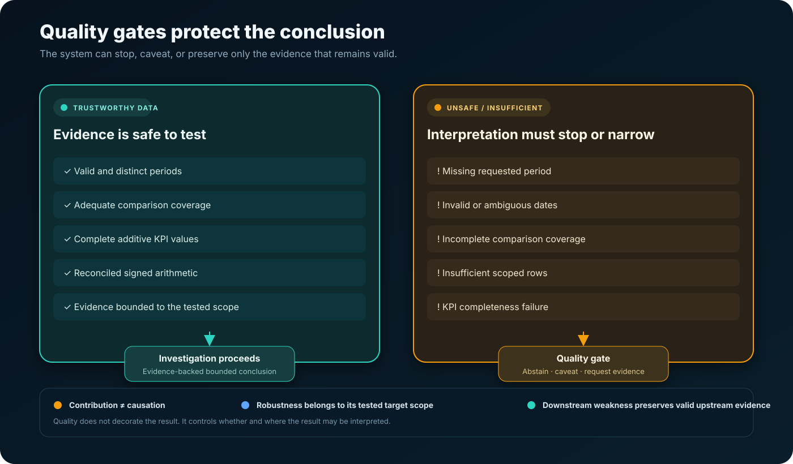
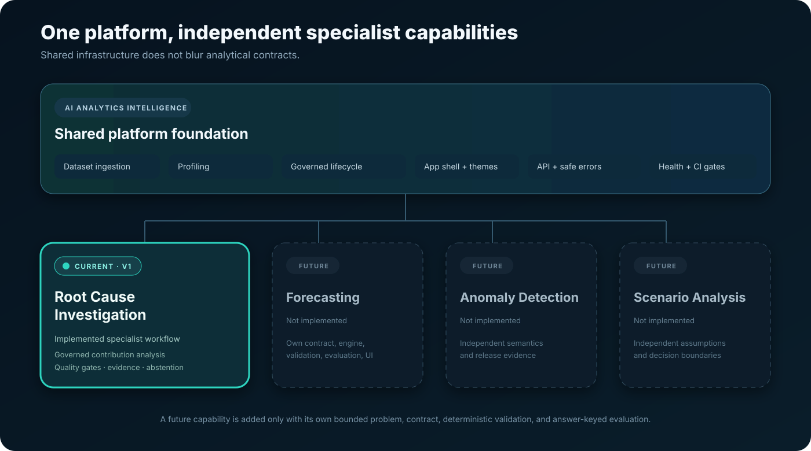

<div align="center">



### AI Root Cause Investigation Agent

An evidence-governed analytics agent that investigates business KPI movements through deterministic contribution analysis, bounded hypothesis testing, verification, and explicit uncertainty.

[](https://www.python.org/)
[](https://fastapi.tiangolo.com/)
[](https://nextjs.org/)
[](https://www.postgresql.org/)
[](https://playwright.dev/)
[](https://github.com/vanshdhiman090/Ai-Analytics-intelligence-August-2026/actions/workflows/backend-tests.yml)
[](docs/FINAL_VALIDATION.md)

**Current specialist capability:** Root Cause Investigation<br>
**Application shell:** AI Analytics Intelligence

</div>

## Product demo

<!--
DEMO GIF SLOT

After the owner records the real validated workflow, save it as:

assets/demo.gif

Then replace this comment with:


Recommended recording:
Upload hero dataset
→ configure Revenue investigation
→ run investigation
→ show Germany → Mobile → Returning
→ show 127.3% contribution + offset explanation
→ show readiness / robustness / evidence
→ briefly switch light/dark mode
-->

## What this is

The AI Root Cause Investigation Agent investigates a defined movement in an additive business KPI using structured tabular data. It is built for analysts, product teams, operations teams, data teams, and decision-makers asking questions such as:

> Why did Revenue fall from January to February?

Instead of returning a one-shot explanation, the agent:

- validates the dataset, KPI, and comparison periods;
- turns approved business dimensions into bounded hypotheses;
- calculates signed segment contributions deterministically;
- follows supported evidence through a governed investigation path;
- tests competing explanations and checks reconciliation;
- detects when data quality is unsafe;
- verifies the scope of the evidence;
- communicates caveats, readiness, and robustness separately; and
- recommends the next analytical action.

Its strongest output is a **leading tested contributor** or, when verification supports it at the selected scope, a **robust descriptive explanation**. Neither is causal proof.

## Why it matters

Dashboards usually tell teams **what changed**. Human analysts must still slice dimensions, compare periods, reconcile totals, test alternative explanations, inspect missing data, and document what the evidence can safely support.

A generic chatbot creates the opposite risk: it can sound convincing without tying its arithmetic back to the dataset.

This product addresses that gap with a governed investigation loop:

```text
structured investigation state
→ bounded analytical tests
→ deterministic evidence
→ verification and stopping rules
→ scoped conclusion with uncertainty
```

It is an analytical investigation workspace—not a generic dashboard builder, open-ended CSV chatbot, or autonomous causal-discovery system.

## Table of contents

- [Product overview](#product-overview)
- [Business problem](#business-problem)
- [Product solution](#product-solution)
- [System architecture](#system-architecture)
- [How the investigation works](#how-the-investigation-works)
- [Hero investigation](#hero-investigation)
- [Why this is an agent](#why-this-is-an-agent)
- [AI reasoning vs deterministic calculation](#ai-reasoning-vs-deterministic-calculation)
- [Data quality, uncertainty, and abstention](#data-quality-uncertainty-and-abstention)
- [Engineering proof](#engineering-proof)
- [Technology stack](#technology-stack)
- [Project structure](#project-structure)
- [Quickstart on Windows](#quickstart-on-windows)
- [Run the hero demo](#run-the-hero-demo)
- [Testing and validation](#testing-and-validation)
- [Public API boundary](#public-api-boundary)
- [Future capability architecture](#future-capability-architecture)
- [Business impact](#business-impact)
- [Honest limitations](#honest-limitations)
- [Security and operational boundary](#security-and-operational-boundary)
- [Roadmap](#roadmap)
- [Author](#author)

---

## Product overview

The user uploads one CSV or XLSX dataset, defines an additive `SUM` KPI, selects baseline and comparison periods, and approves candidate dimensions. The system profiles the data, executes a bounded investigation, and presents:

- the signed KPI movement;
- the selected investigation path;
- the leading tested contributor at each scope;
- downward pressure, positive offsets, and reconciliation tie-out;
- target-scoped evidence strength and robustness;
- data-quality findings and caveats;
- explanatory readiness; and
- the recommended next analytical action.

The professional Next.js workspace includes recoverable errors, duplicate-submission protection, responsive layouts, persistent light/dark themes, bounded summary copy, and an allow-listed public JSON export.

## Business problem

Teams investigating a KPI movement commonly face four problems:

1. **Manual slicing:** the analyst repeatedly filters Geography, Device, Channel, Product, or Customer segments.
2. **Misleading percentages:** a large percentage decline can be immaterial to the total KPI movement, while offsets can make valid contribution shares exceed 100%.
3. **Weak evidence discipline:** data-quality incidents and competing explanations are easily overlooked when pressure exists to produce an answer.
4. **Unsupported narratives:** a plausible correlation can be presented as a cause without a causal design.

The product is designed to make this workflow reproducible and explicit: hypotheses → tests → evidence → updated status → deeper scope → verification → bounded conclusion.

## Product solution

| Capability | What it does |
| --- | --- |
| Structured dataset ingestion | Accepts bounded CSV/XLSX uploads, profiles the dataset, and returns an opaque dataset identifier. |
| Governed KPI configuration | Requires an explicit additive KPI, time field, grain, baseline, comparison, and approved dimensions. |
| Bounded hypothesis investigation | Represents candidate dimensions as hypotheses and tests only allowed analytical actions. |
| Deterministic contribution analysis | Calculates KPI movement and signed segment contributions in Python—not in an LLM. |
| Recursive investigation path | Scopes into supported segments up to a server-governed maximum depth of three. |
| Competing-explanation testing | Avoids manufacturing one winner when several decompositions are genuinely competitive. |
| Data-quality abstention | Detects unsafe periods, dates, coverage, completeness, or scoped sample conditions before interpretation. |
| Signed reconciliation | Preserves downward pressure, positive offsets, remaining segment movement, and reconciliation tie-out. |
| Evidence and uncertainty | Publishes evidence references, strength, caveats, readiness, and robustness at the applicable scope. |
| Safe result utilities | Copies a bounded non-causal summary and exports only allow-listed public response fields. |
| Professional workspace | Provides a focused RCA workflow, responsive behavior, accessible controls, and persistent light/dark themes. |
| Release-gated validation | Gates deterministic backend behavior and public browser semantics in GitHub Actions. |

## System architecture



The real public RCA V1 request path is:

1. **Next.js Investigation Workspace** collects the dataset and bounded configuration.
2. **`POST /datasets`** validates the upload, profiles it deterministically, stores it under a governed local lifecycle, and returns an opaque UUID.
3. **`POST /v1/rca/investigations`** validates the public typed contract and resolves the server-owned dataset.
4. **Governed RCA service** maps public inputs into internal investigation contracts while keeping maximum depth and analytical thresholds server-owned.
5. **Deterministic investigation runtime** calculates KPI movement, signed contributions, offsets, scoped quality checks, and reconciliation.
6. **Verification and conclusion compiler** limits the conclusion to what the evidence supports.
7. **Public response mapper** exposes only the typed result required by the frontend.
8. **InvestigationResult UI** renders the path, contribution arithmetic, quality, uncertainty, evidence, and next action.

PostgreSQL stores application metadata and supports the broader durable workflow. Uploaded analysis files use governed local storage with retention controls in the accepted single-workspace operating envelope. GitHub Actions gates backend tests, the Next.js production build, and Chromium Playwright tests.

The repository still contains a historical `RootCauseAgent` adapter and broader LangGraph workflow. That adapter is **not** the mandatory execution path for `POST /v1/rca/investigations`.

## How the investigation works



At each tested scope, the runtime maintains typed investigation state and performs a controlled loop:

1. validate required columns, date semantics, period presence, coverage, and KPI completeness;
2. create or prioritize hypotheses from the approved dimensions;
3. execute deterministic contribution tests;
4. store the evidence from every test;
5. update each hypothesis as supported, weak, rejected, or unresolved;
6. select a material contributor using contribution to total movement—not percentage decline alone;
7. scope one level deeper when the evidence and depth policy allow it;
8. test competing explanations and run verification checks; and
9. compile the strongest bounded conclusion plus a recommended next action.

The investigation can stop without a confident winner:

| Condition | Public behavior |
| --- | --- |
| Unsafe or incomplete data | `data_quality_abstention` or a scoped caveat |
| Genuinely competing evidence | `competing_explanations` |
| No sufficiently material tested contributor | `inconclusive / no_material_driver` |
| Maximum depth reached | Bounded descriptive conclusion plus a next analytical action |

## Hero investigation

The controlled ecommerce fixture [`demo-data/rca-revenue-incident.csv`](demo-data/rca-revenue-incident.csv) contains 320 order-level rows across two complete monthly periods.

| KPI | January 2026 | February 2026 | Movement |
| --- | ---: | ---: | ---: |
| Revenue | €16,000 | €14,600 | **-€1,400 (-8.75%)** |

The real browser-to-runtime validation selected:

```text
Global Revenue                         -€1,400
└── Germany                            -€1,200   85.7% of global movement
    └── Mobile                         -€1,100   91.7% of Germany movement
        └── Returning                  -€1,400  127.3% of Mobile movement
```

### Why 127.3% is valid

The selected Returning-customer segment applies more downward pressure than the final Germany → Mobile movement because another segment offsets part of the decline:

```text
Returning contribution                -€1,400
New-customer positive offset             +€300
                                       -------
Germany → Mobile movement              -€1,100
Reconciliation residual                     €0
```

`127.3%` is a signed contribution share—not confidence, not an error, and not causal certainty. The UI correctly preserves the value instead of clamping it to 100%.

France contributes a `+€200` global offset in the controlled fixture and answer key. The public V1 result currently presents the selected path and selected target decomposition rather than every upstream segment table, so that France offset is benchmark-verified but not separately rendered in the current UI.

**Published outcome:** Leading tested contributor · `ready_with_caveats` · selected-target robustness not verified · bounded by maximum depth · descriptive contribution evidence, not causal proof.

See the [complete hero walkthrough](docs/HERO_DEMO.md) and [fixture ground truth](demo-data/rca-revenue-incident-ground-truth.md).

## Why this is an agent

This is not a static dashboard or a one-shot prompt. The system maintains structured investigation state and moves through a bounded analytical process.

It can:

- select among allowed next tests;
- carry hypotheses and evidence across investigation scopes;
- update hypothesis status after deterministic tests;
- follow a supported segment deeper;
- challenge the leading explanation with alternatives;
- verify evidence and robustness at the correct scope;
- stop when evidence is unsafe or insufficient;
- abstain instead of forcing a story; and
- recommend what an analyst should test next.

The agent controls **what to test next** within policy. Deterministic Python controls **what the numbers are**. Verification controls **what may be claimed**.

## AI reasoning vs deterministic calculation



Optional Gemini assistance may prioritize an allowed dimension or bounded next test. Every proposal must match a strict action contract and pass validation. Provider failure, timeout, or rejected output triggers deterministic fallback.

The model cannot:

- calculate KPI or contribution values;
- invent evidence;
- execute generated Python or SQL;
- change server-owned thresholds or maximum depth;
- bypass data-quality, reconciliation, or verification gates; or
- upgrade descriptive evidence into causal proof.

This separation protects analytical correctness from provider availability and persuasive but unsupported language.

## Data quality, uncertainty, and abstention



Data quality is part of the reasoning path—not a footnote added after the conclusion. The runtime checks required fields, parseable dates, requested periods, comparison coverage, metric completeness, and scoped row sufficiency.

Three semantic boundaries are enforced:

- **Contribution ≠ causation.** A segment can mathematically account for movement without causing it.
- **Robustness is scope-specific.** Upstream verification is not attached to an unverified deeper target.
- **Downstream weakness does not erase valid upstream evidence.** A deeper data-quality block limits further claims while preserving a valid upstream contribution.

This produces controlled outcomes such as data-quality abstention, competing explanations, inconclusive results, or conclusions that are ready only with explicit caveats.

## Engineering proof

| Verified evidence | Result | What it establishes |
| --- | ---: | --- |
| Maintained backend suite | **289 passed · 1 legitimate skip · 0 failed** | Contracts, deterministic calculations, API mapping, lifecycle, failure handling, and regression behavior. |
| Browser release suite | **19 passed · 0 failed** | Public semantics, signed arithmetic, failure recovery, accessibility, responsiveness, themes, and safe export. |
| Frontend production build | **Passed** | Next.js production compilation succeeds. |
| Controlled real-world RCA benchmark | **5/5 scenarios passed** | Bounded regression coverage across deliberately different RCA behaviors. |
| Real hero workflow | **Completed** | Browser → frontend → API → governed RCA runtime → rendered result. |
| GitHub Actions | **Backend and frontend gates passed** | Release checks run on pull requests and `main`. |
| Engineering acceptance | **RELEASE CANDIDATE: PASS** | Suitable for local portfolio demonstration and controlled single-workspace pilot use. |

The five controlled scenarios cover:

1. clear ecommerce contributor: Germany → Mobile → Returning;
2. competing explanations with no manufactured winner;
3. unsafe data producing `data_quality_abstention`;
4. diffuse movement producing `inconclusive / no_material_driver`; and
5. a non-revenue operations KPI: Europe → Carrier B → Warehouse North.

These results establish bounded regression coverage. They do **not** establish 100% accuracy, universal reliability, autonomous causal discovery, or public-production readiness. The complete acceptance record is in [Final validation](docs/FINAL_VALIDATION.md).

## Technology stack

| Layer | Implemented technology |
| --- | --- |
| Frontend | Next.js 16, React 18, JavaScript, responsive CSS |
| Backend/API | Python 3.13 release environment, FastAPI, Uvicorn, Pydantic contracts |
| Deterministic analytics | pandas, NumPy, typed RCA domain contracts |
| Database | SQLAlchemy with PostgreSQL support; SQLite is used for isolated CI tests |
| Dataset formats | CSV and XLSX via pandas/openpyxl |
| Agent control | Governed planner/controller services with deterministic fallback; broader LangGraph workflow remains separate from the public RCA path |
| Optional provider | Google Gemini through `google-genai`; not a calculation or readiness dependency |
| Backend testing | pytest |
| Browser testing | Playwright with Chromium |
| CI | GitHub Actions: Python 3.13, Node.js 22, backend tests, production build, browser tests |
| Version control | Git and GitHub |

## Project structure

```text
ai-analytics-workspace/
│
├── backend/
│   ├── app/
│   │   ├── api/                 # FastAPI routes and public RCA contracts
│   │   ├── domain/              # Typed investigation and semantic contracts
│   │   ├── services/            # RCA runtime, control, verification, lifecycle
│   │   ├── agent/               # Broader governed workflow and adapters
│   │   └── evals/               # Answer-keyed evaluation runners
│   ├── migrations/
│   └── tests/
│
├── frontend/
│   ├── src/
│   │   ├── app/                 # Next.js application and theme styles
│   │   ├── components/
│   │   │   ├── rca/             # Investigation workflow and result UI
│   │   │   ├── shell/           # Product identity and theme control
│   │   │   └── shared/          # Contract-bounded result utilities
│   │   └── lib/                 # API, presentation, export, capability registry
│   └── e2e/                     # Playwright release suite
│
├── demo-data/
│   ├── benchmarks/              # Controlled real-world RCA cases
│   ├── rca-revenue-incident.csv
│   └── rca-revenue-incident-ground-truth.md
├── docs/
├── assets/
├── .github/workflows/
├── Setup-Agent.cmd
├── Start-Agent.cmd
├── Stop-Agent.cmd
└── README.md
```

## Quickstart on Windows

### Requirements

- Windows with PowerShell
- Python 3.13 recommended
- Node.js 22 and npm
- PostgreSQL with permission to create the project schema
- Gemini API key only if optional provider-assisted prioritization is desired

### Install

```powershell
git clone https://github.com/vanshdhiman090/Ai-Analytics-intelligence-August-2026.git
cd Ai-Analytics-intelligence-August-2026
.\Setup-Agent.cmd
```

Copy `backend/.env.example` to `backend/.env`, set `DATABASE_URL`, and apply the SQL files in `backend/migrations/` in numeric order. Never commit `.env` or real credentials.

### Start and stop

```powershell
.\Start-Agent.cmd
```

Open [http://127.0.0.1:3010](http://127.0.0.1:3010).

When finished:

```powershell
.\Stop-Agent.cmd
```

Operational configuration and controlled-pilot requirements are documented in [Operations](docs/OPERATIONS.md).

## Run the hero demo

Upload [`demo-data/rca-revenue-incident.csv`](demo-data/rca-revenue-incident.csv), then configure:

| Field | Value |
| --- | --- |
| KPI name | `Revenue` |
| Metric column | `revenue` |
| Time column | `date` |
| Time grain | `month` |
| Unit | `EUR` |
| Baseline period | `2026-01` |
| Comparison period | `2026-02` |
| Candidate dimensions | `country`, `device`, `customer_type`, `acquisition_channel` |

Expected bounded result:

- KPI movement: **-€1,400**;
- selected path: **Germany → Mobile → Returning**;
- deepest positive offset: **+€300**;
- selected-decomposition reconciliation residual: **€0**;
- readiness: **ready with caveats**;
- selected-target robustness: **not verified**; and
- boundary: **maximum depth reached**.

Provider latency can vary. Deterministic fallback preserves calculation correctness when provider assistance is unavailable. A detailed reproducibility checklist is available in [Real RCA smoke test](demo-data/REAL_RCA_SMOKE_TEST.md).

## Testing and validation

### Backend

```powershell
cd backend
$env:CHECKPOINT_BACKEND="memory"
$env:DATABASE_URL="sqlite+pysqlite:///:memory:"
python -m pytest -q
```

### Controlled RCA benchmark

```powershell
cd backend
$env:CHECKPOINT_BACKEND="memory"
python -m app.evals.real_world_rca_benchmark_runner
```

### Frontend

```powershell
cd frontend
npm ci
npm run build
npm run test:e2e
```

The validated release-candidate results are:

- backend: **289 passed, 1 skipped, 0 failed**;
- frontend build: **passed**;
- Playwright: **19 passed, 0 failed**;
- controlled benchmark: **5/5 passed**; and
- GitHub Actions backend and frontend gates: **successful**.

See [Final validation](docs/FINAL_VALIDATION.md) for the complete engineering acceptance record.

## Public API boundary

### `POST /datasets`

Accepts one bounded CSV/XLSX upload, performs validation and profiling, stores it under the governed local lifecycle, and returns an opaque dataset identifier plus a bounded profile and preview.

### `POST /v1/rca/investigations`

Accepts the opaque dataset ID, goal, additive KPI definition, two periods, and approved dimensions. The endpoint is synchronous. Clients cannot control analytical thresholds, maximum depth, verification, or conclusion policy.

The public response contains only:

- API version and investigation ID;
- KPI movement;
- selected investigation path;
- leading tested contributor;
- selected target decomposition;
- conclusion, caveats, readiness, robustness, and next action;
- bounded data-quality status; and
- response-local supporting evidence references.

It does **not** expose prompts, raw provider output, filesystem paths, stack traces, credentials, raw mutable agent state, or raw dataset rows. Expected failures use sanitized structured errors with request IDs.

Opaque IDs and bounded response mapping are important safety controls, but they do not constitute public authentication or tenant security.

## Future capability architecture



**AI Analytics Intelligence** is designed as one shared platform for multiple independent specialist analytical capabilities.

| Capability | Status |
| --- | --- |
| Root Cause Investigation | **CURRENT · IMPLEMENTED** |
| Forecasting | **FUTURE · NOT IMPLEMENTED** |
| Anomaly Detection | **FUTURE · NOT IMPLEMENTED** |
| Scenario Analysis | **FUTURE · NOT IMPLEMENTED** |

Any future capability should own its own API contract, analytical engine, deterministic validation, evaluation framework, semantic safety rules, and frontend workflow. Future capabilities must not reuse RCA state as generic analytics state or appear in navigation before they exist.

See [Capability architecture](docs/CAPABILITY_ARCHITECTURE.md) for the isolation principle.

## Business impact

The product is designed to:

- reduce repetitive dashboard slicing during KPI investigations;
- make contribution arithmetic reproducible and reviewable;
- surface data-quality problems before business interpretation;
- provide a repeatable hypothesis → test → evidence workflow;
- help teams communicate evidence and uncertainty consistently;
- reduce unsupported narrative explanations; and
- make investigations easier to audit and reproduce.

These are intended workflow benefits. No customer adoption, financial ROI, or measured time-saving claim is made.

## Honest limitations

This release candidate is suitable for a **local portfolio demonstration** and **controlled single-workspace pilot**. It is not a secure public multi-user SaaS.

- Supports additive `SUM` KPI investigations only.
- Accepts structured CSV and XLSX datasets.
- Uses a synchronous public RCA request.
- Enforces a server-governed maximum depth of three.
- Uses governed local file storage and process-local active-dataset protection.
- Does not provide real public user authentication or authorization.
- Does not provide tenant isolation.
- Does not provide a distributed queue, execution, locking, or idempotency layer.
- Does not use production object storage or malware scanning.
- Does not include an enterprise secret manager or public abuse controls.
- Does not perform causal inference; it identifies tested descriptive contributors.
- Controlled benchmarks provide regression evidence, not universal analytical accuracy.
- The public V1 result does not expose every segment table from every tested upstream decomposition.

## Security and operational boundary

Implemented controls include request IDs, sanitized errors, readiness checks, bounded dataset retention, provider fallback, controlled-pilot configuration guardrails, safe public response mapping, and backend/browser CI gates.

The browser-visible `NEXT_PUBLIC_API_KEY` is a pilot access gate, not a secret and not public authentication.

Before public or multi-user production, the platform would still require:

- user and organization authentication;
- authorization and tenant isolation;
- distributed execution, idempotency, locking, and worker coordination;
- encrypted object storage with retention and deletion policies;
- malware scanning and upload abuse protection;
- rate limiting and quotas;
- managed secrets and rotation;
- centralized logs, metrics, traces, alerts, and audit retention; and
- horizontal cleanup and worker coordination.

See [Operations](docs/OPERATIONS.md) and [Production readiness](docs/PRODUCTION_READINESS.md) for the full boundary.

## Roadmap

### Completed

- governed RCA V1 public API;
- deterministic signed contribution analysis and reconciliation;
- bounded recursive investigation path;
- data-quality abstention and scoped caveats;
- competing-explanation and no-material-driver behavior;
- verification and deterministic conclusion compiler;
- professional Next.js investigation workspace;
- persistent light/dark themes and bounded public export;
- controlled answer-keyed benchmarks;
- backend and frontend GitHub Actions gates; and
- release-candidate engineering validation.

### Future / possible

- public-deployment security architecture;
- real authentication, authorization, and tenancy;
- encrypted object storage and asynchronous execution where needed;
- richer governed data connectors;
- broader answer-keyed evaluation coverage; and
- additional independent specialist analytics capabilities, including possible future forecasting, anomaly-detection, and scenario-analysis products.

Future items are architectural directions, not implemented features or delivery commitments. See the [Roadmap](docs/ROADMAP.md).

## Additional documentation

- [Architecture](docs/ARCHITECTURE.md)
- [Hero demo](docs/HERO_DEMO.md)
- [Interview story](docs/INTERVIEW_STORY.md)
- [Capability architecture](docs/CAPABILITY_ARCHITECTURE.md)
- [Operations](docs/OPERATIONS.md)
- [Production readiness](docs/PRODUCTION_READINESS.md)
- [Final validation](docs/FINAL_VALIDATION.md)

## Author

**Vansh Dhiman**

GitHub: [github.com/vanshdhiman090](https://github.com/vanshdhiman090)
